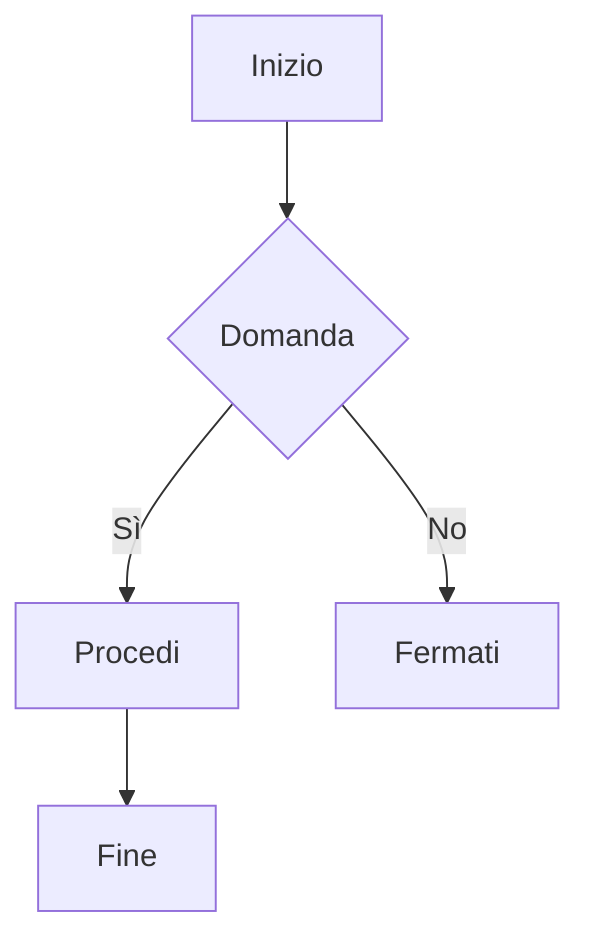
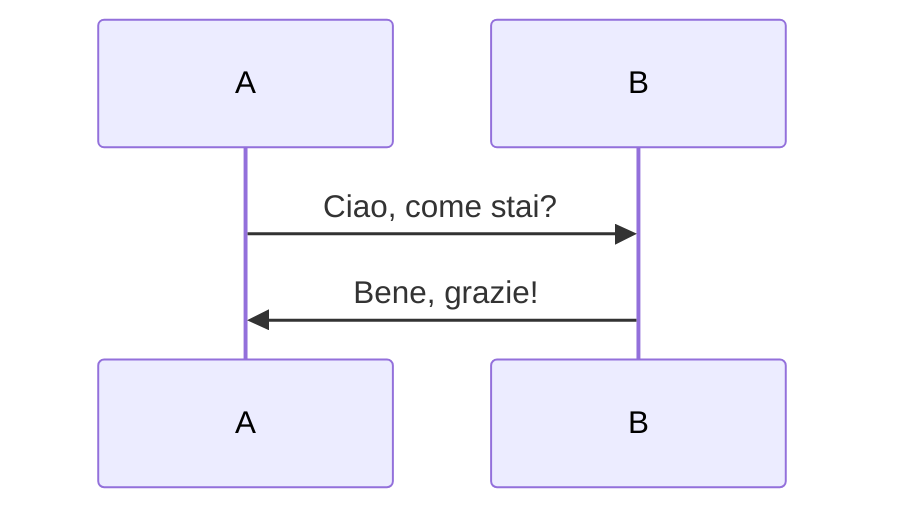
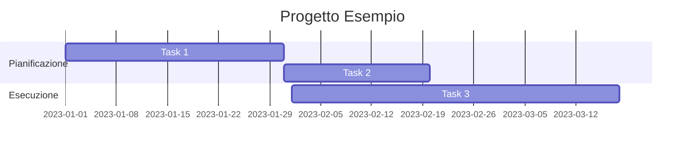

# Corso Completo: Sintassi Avanzata di Markdown

Markdown è un linguaggio di markup semplice che permette di formattare testo in modo rapido ed efficiente. Di seguito trovi una panoramica più approfondita delle principali funzionalità di Markdown, inclusi esempi avanzati, approfondimenti sulle immagini e sui diagrammi di flusso.

## 1. Titoli
Usa il simbolo `#` per creare titoli, con diversi livelli di enfasi. Puoi avere fino a sei livelli di titolo, ognuno con una dimensione e una prominenza decrescenti:

```markdown
# Titolo di livello 1
## Titolo di livello 2
### Titolo di livello 3
#### Titolo di livello 4
##### Titolo di livello 5
###### Titolo di livello 6
```
**Risultato di output:**

# Titolo di livello 1

## Titolo di livello 2

### Titolo di livello 3

#### Titolo di livello 4

##### Titolo di livello 5

###### Titolo di livello 6

---


Puoi anche combinare il titolo con altri formati di testo, ad esempio:

```markdown
# **Titolo in Grassetto di Livello 1**
```
**Risultato di output:**
# **Titolo in Grassetto di Livello 1**

## 2. Testo Formattato
Markdown supporta diversi stili di formattazione del testo:

- **Grassetto**: Usa doppio asterisco `**` o doppio trattino basso `__` per dare enfasi forte al testo.
  ```markdown
  **Testo in grassetto**
  __Testo in grassetto__
  ```
- *Corsivo*: Usa un asterisco `*` o un trattino basso `_` per dare enfasi leggera.
  ```markdown
  *Testo in corsivo*
  _Testo in corsivo_
  ```
- **Grassetto e Corsivo**: Combina tre simboli `***` per dare una maggiore enfasi.
  ```markdown
  ***Testo in grassetto e corsivo***
  ```
- ~~Barrato~~: Usa due tilde `~~` per indicare testo cancellato.
  ```markdown
  ~~Testo barrato~~
  ```
- `Monospazio`: Racchiudi il testo tra backtick singoli per rappresentare codice inline.
  ```markdown
  Questo è `inline code`.
  ```
**Risultato di output:**

- **Testo in grassetto**
- *Testo in corsivo*
- ***Testo in grassetto e corsivo***
- ~~Testo barrato~~
- Questo è `inline code`

---

### Paragrafi e Interruzioni di Linea
I paragrafi sono creati con una linea vuota tra di essi. Per creare un'interruzione di linea senza iniziare un nuovo paragrafo, usa due spazi alla fine della linea:

```markdown
Questo è il primo verso.  
Questo è il secondo verso sulla stessa linea visiva.
```

## 3. Liste

### Liste Non Numerate
Per creare una lista non numerata, puoi usare `-`, `*`, o `+` come simbolo del punto elenco. Puoi anche nidificare liste aggiungendo due spazi:

```markdown
- Elemento 1
  - Sotto-elemento 1.1
    * Sotto-elemento 1.1.1
- Elemento 2
* Elemento 3
```
**Risultato di output:**

- Elemento 1
  - Sotto-elemento 1.1
    - Sotto-elemento 1.1.1
- Elemento 2
* Elemento 3

---

### Liste Numerate
Per creare una lista numerata, utilizza numeri seguiti da un punto. Markdown gestisce automaticamente la numerazione, quindi anche se usi `1.` per ogni elemento, verranno numerati in sequenza:

```markdown
1. Primo elemento
2. Secondo elemento
   1. Sotto-elemento 2.1
   2. Sotto-elemento 2.2
3. Terzo elemento
```
**Risultato di output:**

1. Primo elemento
2. Secondo elemento
   1. Sotto-elemento 2.1
   2. Sotto-elemento 2.2
3. Terzo elemento

---


## 4. Link e Immagini

- **Link**: Crea un collegamento utilizzando parentesi quadre `[]` seguite da parentesi tonde `()`, dove le parentesi quadre contengono il testo del link e le tonde contengono l'URL.
  ```markdown
  [Visita OpenAI](https://www.openai.com)
  ```
  **Risultato di output:**
[Visita OpenAI](https://www.openai.com)

---
  Puoi anche aggiungere un testo alternativo per descrivere il link:
  ```markdown
  [Scopri di più su OpenAI](https://www.openai.com "Sito ufficiale di OpenAI")
  ```
- **Immagini**: Aggiungi un punto esclamativo `!` prima delle parentesi quadre per inserire un'immagine. Le parentesi quadre contengono il testo alternativo e le parentesi tonde contengono l'URL dell'immagine.
  ```markdown
  
  ```
  Puoi anche controllare le dimensioni dell'immagine usando HTML:
  ```markdown
  
  ```

### Immagini con Link
Puoi combinare un'immagine con un link per renderla cliccabile:

```markdown
[](https://www.openai.com)
```
**Risultato di output:**
[](https://www.openai.com)

---
```markdown
Ciao **[sono un link](https://google.com "titolo: sito google")** click! ☝️
<https://google.com>
<francesco.lucignano@gmail.com>
```
**Risultato di output:**
Ciao **[sono un link](https://google.com "titolo: sito google")** click! ☝️
<https://google.com>
<francesco.lucignano@gmail.com>

---

### Gallerie di Immagini
Per creare una sorta di galleria di immagini, puoi elencare più immagini di seguito:

```markdown


```
**Risultato di output:**


---

## 5. Citazioni
Le citazioni vengono create utilizzando il simbolo `>`. Le citazioni possono essere annidate per aumentare i livelli di profondità:

```markdown
> Questa è una citazione.
> > Questa è una citazione annidata.
```
**Risultato di output:**

> Questa è una citazione.
>
> > Questa è una citazione annidata.

---

Le citazioni possono contenere anche altri elementi Markdown, come liste o codice:

```markdown
> ### Titolo nella citazione
> - Elemento di una lista
> - Altro elemento
```

## 6. Codice

- **Inline Code**: Usa i backtick `` ` `` per racchiudere il codice inline.
  ```markdown
  Questo è `inline code`.
  ```
**Risultato di output:**
Questo è `inline code`.

---

- **Blocchi di Codice**: Usa tre backtick ``` ``` per creare un blocco di codice. Puoi specificare il linguaggio di programmazione dopo i backtick per abilitare la colorazione della sintassi:
  ```markdown
  ```python
  def funzione():
      print("Ciao, mondo!")
  ```
  ```
**Risultato di output:**

```python
def funzione():
    print("Ciao, mondo!")
```
---

## 7. Tabelle
Le tabelle possono essere create utilizzando il carattere `|` per separare le colonne e `-` per separare l'intestazione dal contenuto. Puoi anche allineare il contenuto delle colonne utilizzando `:`:
**Esempio di costruzione:**

```markdown
| Intestazione 1 | Intestazione 2 |
| -------------- | -------------- |
| Valore 1       | Valore 2       |
| Valore 3       | Valore 4       |
```

**Risultato di output:**

| Intestazione 1 | Intestazione 2 |
| -------------- | -------------- |
| Valore 1       | Valore 2       |
| Valore 3       | Valore 4       |


Altri esempi:
```markdown
First column name  | Second column name 
-------------------|------------------
Row 1, Col 1       | Row 1, Col 2 
Row 2, Col 1       | Row 2, Col 2 

```
**Risultato di output:**

First column name  | Second column name 
-------------------|------------------
Row 1, Col 1       | Row 1, Col 2 
Row 2, Col 1       | Row 2, Col 2 


```markdown
| Intestazione 1 | Intestazione 2 | Intestazione 3 |
| :------------: | :------------- | -------------: |
| Centrato       | Allineato a sinistra | Allineato a destra |
| Valore 1       | Valore 2       | Valore 3       |
| Valore 4       | Valore 5       | Valore 6       |
```

Puoi anche aggiungere immagini all'interno delle tabelle:

```markdown
| Prodotto       | Immagine                        | Prezzo     |
| -------------- | ------------------------------- | ---------- |
| Prodotto 1     |  | $10.00     |
| Prodotto 2     |  | $20.00     |
```

---

## 8. Separatori
Per aggiungere una linea orizzontale, usa tre o più trattini `-`, asterischi `*`, o underscore `_`. I separatori possono essere utili per dividere sezioni del documento:

```markdown
---
```

## 9. Elenco di Spunta (Task List)
Puoi creare un elenco di spunta utilizzando i caratteri `- [ ]` per un elemento non completato e `- [x]` per un elemento completato. Questi sono utili per liste di attività o per rappresentare progresso:

```markdown
- [ ] Compito 1
- [x] Compito 2 (completato)
- [ ] Compito 3
```
**Risultato di output:**
- [ ] Compito 1
- [x] Compito 2 (completato)
- [ ] Compito 3

---

## 10. Aggiunta di HTML Personalizzato
Markdown permette di inserire anche codice HTML diretto per una maggiore flessibilità. Ad esempio, puoi aggiungere un paragrafo con colore personalizzato:

```markdown
<p style="color: red;">Questo è un paragrafo in rosso.</p>
```

Puoi anche usare HTML per creare immagini con attributi personalizzati:

```markdown

```

## 11. Riferimenti ai Link
Puoi definire i link separatamente dal testo per una migliore leggibilità, specialmente quando ci sono molti link ripetuti. Ecco un esempio di link referenziato:

```markdown
Questo è un [link di esempio][esempio-link].

[esempio-link]: https://www.esempio.com "Titolo del link"
```

## 12. Escape di Caratteri Speciali
Se hai bisogno di visualizzare un carattere speciale come `*`, `_`, `#`, ecc., puoi usare la barra inversa `\` per far sì che non venga interpretato da Markdown:

```markdown
Usa il simbolo \* per un asterisco.
```

## 13. Formule centrate
Ecco un esempio di formula LateX e scrittura al centro del paragrafo:
::: {style="text-align: center;"}
## \[E = mc^2\]
:::

- ### 13.1 Un alternativa per centrare il testo:
<div align="center">
$$
E = mc^2
$$
</div>

- ### 13.2 Utilizzare Equazioni come Immagini
Se desideri visualizzare una formula in formato LaTeX e GitHub Pages non la supporta nativamente, puoi generare un'immagine della formula utilizzando un editor LaTeX online e poi includerla come immagine nel documento.

1. Crea la tua formula usando un editor online come [QuickLaTeX](https://quicklatex.com/) o [LaTeX to PNG](https://latex2png.com/).
2. Scarica l'immagine generata della tua formula.
3. Includi l'immagine nel tuo documento Markdown:


Questo ti permette di visualizzare la formula in modo simile a come verrebbe resa nativamente in LaTeX.

# Esempi di equations:

$y=x^2$

$e^{i\pi} + 1 = 0$

$e^x=\sum_{i=0}^\infty \frac{1}{i!}x^i$

$\frac{n!}{k!(n-k)!} = {n \choose k}$

$A_{m,n} =
 \begin{pmatrix}
  a_{1,1} & a_{1,2} & \cdots & a_{1,n} \\
  a_{2,1} & a_{2,2} & \cdots & a_{2,n} \\
  \vdots  & \vdots  & \ddots & \vdots  \\
  a_{m,1} & a_{m,2} & \cdots & a_{m,n}
 \end{pmatrix}$


## RECAP Principal Reference

Markdown | Preview
--- | ---
`**bold text**` | **bold text**
`*italicized text*` or `_italicized text_` | *italicized text*
`` `Monospace` `` | `Monospace`
`~~strikethrough~~` | ~~strikethrough~~
`[A link](https://www.google.com)` | [A link](https://www.google.com)
`` | 

## 14. Diagrammi di Flusso
Markdown supporta anche la creazione di diagrammi di flusso utilizzando la sintassi di [Mermaid](https://mermaid-js.github.io/). Mermaid è uno strumento che ti permette di creare diagrammi direttamente nel tuo documento Markdown. Di seguito trovi alcuni esempi di diagrammi di flusso:

### Diagramma di Flusso Base
Per creare un semplice diagramma di flusso, utilizza la seguente sintassi:

**Esempio di costruzione:**


---


### Spiegazione:
- **flowchart TD**: Specifica che il diagramma è un diagramma di flusso e `TD` indica una direzione dall'alto verso il basso (Top to Down). Altre direzioni possibili sono `LR` (sinistra verso destra), `RL` (destra verso sinistra), `BT` (dal basso verso l'alto).
- **A[Inizio]**: Crea un nodo chiamato `A` con il testo `Inizio` all'interno di parentesi quadre, che indica una forma rettangolare.
- **B{Domanda}**: Crea un nodo di tipo decisione (`{}`) con il testo `Domanda`.
- **B -->|Sì| C[Procedi]**: Crea una freccia dal nodo `B` al nodo `C` con l'etichetta `Sì`.

### Diagramma di Sequenza
I diagrammi di sequenza possono essere creati per rappresentare la comunicazione tra diversi attori o sistemi.



### Diagramma Gantt
Puoi anche creare un diagramma di Gantt per la gestione del progetto:



### Spiegazione del Diagramma Gantt
- **gantt**: Inizia il diagramma di Gantt.
- **titolo Progetto Esempio**: Imposta il titolo del diagramma.
- **sezione Pianificazione**: Crea una sezione chiamata `Pianificazione`.
- **Task 1 :a1, 2023-01-01, 30d**: Definisce un'attività chiamata `Task 1` che inizia il 1 gennaio 2023 e dura 30 giorni.

## Conclusione
Markdown è uno strumento versatile che permette di formattare testo in modo semplice e leggibile, con funzionalità avanzate per chi desidera personalizzare ulteriormente i propri documenti. Con queste basi avanzate e con esempi più complessi, sarai in grado di creare documenti professionali e ben strutturati, inclusi diagrammi di flusso per migliorare la chiarezza e la rappresentazione delle informazioni!;
