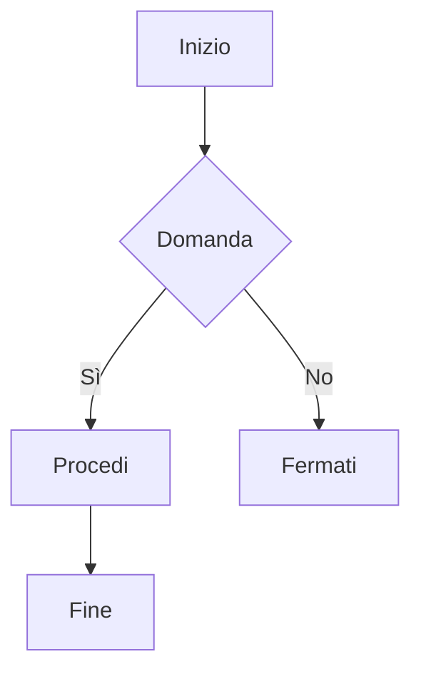

# Corso Completo: Sintassi Avanzata di Markdown

Markdown è un linguaggio di markup semplice che permette di formattare testo in modo rapido ed efficiente. Di seguito trovi una panoramica più approfondita delle principali funzionalità di Markdown, inclusi esempi avanzati e approfondimenti.

---

## 1. Titoli

Usa il simbolo `#` per creare titoli, con diversi livelli di enfasi. Puoi avere fino a sei livelli di titolo, ognuno con una dimensione e una prominenza decrescenti.

**Esempio di costruzione:**

```markdown
# Titolo di livello 1
## Titolo di livello 2
### Titolo di livello 3
#### Titolo di livello 4
##### Titolo di livello 5
###### Titolo di livello 6
```

**Risultato di output:**

# Titolo di livello 1

## Titolo di livello 2

### Titolo di livello 3

#### Titolo di livello 4

##### Titolo di livello 5

###### Titolo di livello 6

---

## 2. Testo Formattato

Markdown supporta diversi stili di formattazione del testo.

**Esempio di costruzione:**

```markdown
- **Grassetto**: `**Testo in grassetto**`
- *Corsivo*: `*Testo in corsivo*`
- **Grassetto e Corsivo**: `***Testo in grassetto e corsivo***`
- ~~Barrato~~: `~~Testo barrato~~`
- `Monospazio`: `Questo è \`inline code\``
```

**Risultato di output:**

- **Testo in grassetto**
- *Testo in corsivo*
- ***Testo in grassetto e corsivo***
- ~~Testo barrato~~
- Questo è `inline code`

---

## 3. Liste

### Liste Non Numerate

Puoi usare `-`, `*`, o `+` per creare liste non numerate e nidificare sottoliste con due spazi.

**Esempio di costruzione:**

```markdown
- Elemento 1
  - Sotto-elemento 1.1
    * Sotto-elemento 1.1.1
- Elemento 2
* Elemento 3
```

**Risultato di output:**

- Elemento 1
  - Sotto-elemento 1.1
    - Sotto-elemento 1.1.1
- Elemento 2

* Elemento 3

---

### Liste Numerate

Utilizza numeri seguiti da un punto per creare una lista numerata.

**Esempio di costruzione:**

```markdown
1. Primo elemento
2. Secondo elemento
   1. Sotto-elemento 2.1
   2. Sotto-elemento 2.2
3. Terzo elemento
```

**Risultato di output:**

1. Primo elemento
2. Secondo elemento
   1. Sotto-elemento 2.1
   2. Sotto-elemento 2.2
3. Terzo elemento

---

## 4. Link e Immagini

### Link

Crea un collegamento utilizzando parentesi quadre `[]` seguite da parentesi tonde `()`.

**Esempio di costruzione:**

```markdown
[Visita OpenAI](https://www.openai.com)
```

**Risultato di output:**
[Visita OpenAI](https://www.openai.com)

---

### Immagini

Aggiungi un punto esclamativo `!` prima delle parentesi quadre per inserire un'immagine.

**Esempio di costruzione:**

```markdown

```

**Risultato di output:**


---

## 5. Citazioni

Le citazioni vengono create utilizzando il simbolo `>`.

**Esempio di costruzione:**

```markdown
> Questa è una citazione.
> > Questa è una citazione annidata.
```

**Risultato di output:**

> Questa è una citazione.
>
> > Questa è una citazione annidata.

---

## 6. Codice

### Inline Code

Racchiudi il codice inline tra backtick singoli.

**Esempio di costruzione:**

```markdown
Questo è `inline code`.
```

**Risultato di output:**
Questo è `inline code`.

---

### Blocchi di Codice

Usa tre backtick per creare un blocco di codice.

**Esempio di costruzione:**

````markdown
```python
def funzione():
    print("Ciao, mondo!")
```
````

**Risultato di output:**

```python
def funzione():
    print("Ciao, mondo!")
```

---

## 7. Tabelle

Le tabelle possono essere create utilizzando `|` per separare le colonne e `-` per separare l'intestazione dal contenuto.

**Esempio di costruzione:**

```markdown
| Intestazione 1 | Intestazione 2 |
| -------------- | -------------- |
| Valore 1       | Valore 2       |
| Valore 3       | Valore 4       |
```

**Risultato di output:**

| Intestazione 1 | Intestazione 2 |
| -------------- | -------------- |
| Valore 1       | Valore 2       |
| Valore 3       | Valore 4       |

---

## 8. Separatori

Usa tre o più trattini `-`, asterischi `*`, o underscore `_` per aggiungere una linea orizzontale.

**Esempio di costruzione:**

```markdown
---
```

## **Risultato di output:**

---

---

## 9. Elenco di Spunta (Task List)

Crea un elenco di spunta utilizzando `- [ ]` per un elemento non completato e `- [x]` per un elemento completato.

**Esempio di costruzione:**

```markdown
- [ ] Compito 1
- [x] Compito 2 (completato)
- [ ] Compito 3
```

**Risultato di output:**

-

---

## 10. Diagrammi di Flusso

Markdown supporta la creazione di diagrammi di flusso utilizzando la sintassi di Mermaid.

**Esempio di costruzione:**



**Risultato di output:**


---

## Conclusione

Markdown è uno strumento versatile che permette di formattare testo in modo semplice e leggibile, con funzionalità avanzate per chi desidera personalizzare ulteriormente i propri documenti. Con queste basi avanzate e con esempi più complessi, sarai in grado di creare documenti professionali e ben strutturati, inclusi diagrammi di flusso per migliorare la chiarezza e la rappresentazione delle informazioni!

---

